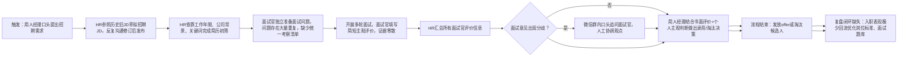

### 任务 1：场景诊断（20 分）

基于模拟材料，在 `01-diagnosis.md` 中完成：

1. 用一句话定义该场景真正要完成的“客户任务”。
2. 画出当前任务链路，至少包括触发、判断、行动、升级、结束和复盘。
3. 找出 3—5 个最值得改造的问题，并区分：
   - 表面症状；
   - 根因假设；
   - 支持证据；
   - 仍需向业务确认的问题。
4. 选择一个本次最小试点边界，并说明为什么暂不处理其他问题。
5. 明确一个最关键的价值假设。

不要求使用特定图形工具，Mermaid、表格或清晰的文本流程均可。

# 01-diagnosis.md

## 1. 客户任务定义（一句话）

用人经理、HR与面试官依托统一的岗位成功标准，收集可溯源的候选人客观面试证据，减少主观偏差，形成有据可依的录用建议，精准筛选适配业务侧AI Builder岗位的人选。

## 2. 当前端到端任务链路

链路节点说明：
- 触发：业务侧提出招聘诉求
- 判断：HR简历筛选、面试官面试过程判断、汇总后分歧判断
- 行动：撰写JD、简历筛选、面试、填写评价、群内沟通分歧
- 升级：面试意见不一致时，微信群追加问询（人工升级路径）
- 结束：候选人录用或淘汰
- 复盘：无常态化复盘与标准迭代机制

## 3. 核心待改造问题

|序号|表面症状|根因假设|支持证据|待向业务确认问题|
| ---- | ---- | ---- | ---- | ---- |
|1|面试官评估标尺不统一，有人侧重技术能力，有人侧重业务推动能力|岗位成功标准仅停留在文档层面，未转化为标准化证据采集清单，无强制落地机制|访谈记录：用人经理、面试官甲、面试官乙考察重点差异明显；历史案例A依靠候选人企业背景降低实操验证标准；历史案例B表明，若面试官仅凭技术熟练度判断，可能遗漏"业务共创与推进"的关键证据|是否允许把岗位成功标准作为面试必填考察框架？面试官能否接受按照标准逐条收集候选人证据？|
|2|面试普遍存在证据缺口，候选人大量自述内容无法验证，缺少定向追问机制|没有自动化工具识别证据缺失点，面试提问完全依赖面试官个人经验|候选人C-017简历多项指标缺少佐证；面试官乙提出候选人缺少主动诊断业务流程相关案例；历史案例C（Demo强但无法交接）表明，面试未系统考察"交接能力"证据，导致入职后试点无法扩散|面试时长是否允许增加针对性追问？团队是否希望控制单候选人面试总轮次？|
|3|多名面试官的评价信息相互割裂，观点冲突依靠人工群聊排查，效率低|面试记录分散存储，缺乏结构化数据录入规范与统一证据数据模型，导致无法生成候选人全景证据视图，冲突依赖人工发现|面试分歧只能通过微信群沟通协调；候选人C-017存在多位面试官差异化评价|所有面试记录是否允许统一结构化归档？是否开放系统自动标记评价冲突的权限？|
|4|招聘流程与员工在职表现割裂，无法持续校准招聘标准|缺少数据回流链路，招聘阶段收集的证据、录用结果无法和试用期表现联动优化岗位标准|材料明确说明入职后表现很少回流岗位标准；历史案例仅做零散文档复盘|团队能否打通招聘数据与员工试用期绩效数据？岗位成功标准计划多久迭代一次？|

## 4. 本次最小试点边界

### 试点范围

仅针对**业务侧AI Builder**单一岗位；搭建「面试证据与追问助手」；能力范围限定：简历、多轮面试记录的证据提取、证据缺口识别、冲突检测、行为面试题推荐。

**暂不纳入改造范围**：简历初筛自动化、offer流程改造、入职绩效数据回流优化岗位标准。

### 边界取舍理由

1. 证据碎片化、面试证据缺口是当前招聘环节最突出痛点，试点投入产出比最高；
2. 简历初筛自动化极易固化历史招聘偏见，合规风险更高，放到二期迭代；
3. 入职表现回流需要跨团队、跨系统打通数据，依赖外部条件，不适合首期试点；
4. 收缩试点范围，集中资源验证核心AI辅助能力，避免流程改动过多，试点目标失控。

## 5. 关键价值假设

借助AI自动梳理标准化、可溯源的候选人证据视图，并基于证据缺口生成定向面试追问问题，能够降低不同面试官的主观判断权重，提升面试评估一致性，减少因证据不足误招"Demo型候选人"，同时不会显著增加面试官工作时长。

该假设将通过离线测试用例（证据召回率、冲突识别准确率）与业务试运行基线（面试官证据完整度、主观评价占比变化）进行验证，详见 `04-value-evaluation.md`。

