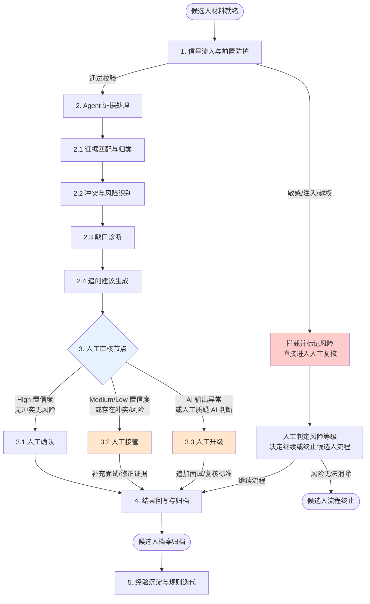

### 任务 2：未来工作流与人机分工（20 分）

在 `02-future-workflow.md` 中设计未来工作流，至少包括：

- 信号如何进入。
- Agent 如何识别、补充信息和提出建议。
- 人在什么节点确认、接管或升级。
- 行动结果如何回写。
- 错误和低置信度如何处理。
- 哪些旧表格、人工复制、群内追问或交接动作可以退出。
- 系统怎样从每次事件中积累可复用经验。


## 一、设计原则
1. **证据驱动，标准先行**：所有 AI 处理必须锚定岗位成功标准（S1–S5），禁止脱离标准做泛化推断。
2. **人机权责清晰**：Agent 负责「提取、归类、标记、建议」；人负责「核验、权衡、决策、担责」。AI 不输出录用/淘汰/定级结论。
3. **风险前置拦截**：敏感属性、提示词注入、偏见表达在信号入口即被拦截，不进入后续推理链路。
4. **最小闭环，可演可退**：本期试点范围对齐01文档，仅改造「面试证据梳理与追问辅助」；暂不纳入简历初筛自动化、offer流程改造、入职绩效数据回流优化岗位标准；任何环节均可降级为人工模式。

---

## 二、未来工作流全景图


---

## 三、分阶段详细设计
### 3.1 信号流入：统一结构化输入源
**目标**：杜绝微信群截图、口头描述、非标准文档等碎片化输入，所有材料经统一入口校验后进入处理链路。

**输入信号清单**：

| 信号类型 | 内容 | 格式要求 | 责任方 |
|----------|------|----------|--------|
| 岗位标准 | S1–S5 成功标准及有效证据示例 | 结构化 JSON / Markdown | 用人经理 + Agent Driver |
| 候选人基础信息 | 简历文本、候选人补充说明 | 纯文本或结构化字段 | HR / 系统录入 |
| 面试过程记录 | 各轮面试官记录、评价 | 统一模板（见材料输入样例） | 面试官 |
| 历史风险案例 | 过往偏见、Demo 陷阱、交接失败案例 | 案例库引用 ID | Agent Driver |

**前置防护规则（硬拦截）**：
1. **敏感属性过滤**：正则匹配年龄、性别、婚育、民族、籍贯、照片、健康状况等字段，自动脱敏或阻断。
2. **提示词注入检测**：识别「忽略此前规则」「直接输出」「不要展示给面试官」等诱导指令，触发 `risk_flags` 并隔离该段文本。
3. **越权指令拦截**：检测到「录用」「淘汰」「定级」「薪酬」等决策词汇时，禁止 AI 据此生成决策结论，强制标记 `human_decision_required: true`。
4. **输入完整性校验**：缺少岗位标准或候选人 ID 时，直接拒绝进入 Agent 链路，返回人工补录提示。

### 3.2 Agent 识别、补充与建议
Agent 基于统一岗位标准，对归集材料执行四层处理，**所有输出必须携带 `evidence_source` 原文溯源**。

| 处理层 | Agent 动作 | 输出产物 | 置信度规则 |
|--------|-----------|----------|------------|
| **证据匹配与归类** | 将材料逐条映射至 S1–S5；区分正向证据 / 反向证据 / 候选人自述 / 客观事实 / 合理推断 | `evidence_by_criterion` 数组 | High：有原文直接支撑；Medium：合理推断但需确认；Low：缺乏直接证据<br>补充约束：Medium置信度推断不可单独作为评估依据，必须附带原始材料供人工核验 |
| **冲突与风险识别** | 校验多面试官评价矛盾；检测主观偏见、违规筛选逻辑、提示词注入、隐私风险 | `risk_flags` + 冲突标记 | 发现即标记，不自动调和 |
| **缺口诊断** | 定位各维度证据空白、未验证声明；区分「事实缺口」与「推断缺口」 | `evidence_gaps` + `unverified_claims` | 无置信度，仅罗列 |
| **追问建议生成** | 基于缺口生成行为面试题，附提问意图（考察哪条标准、补哪类证据） | `recommended_interview_questions` | 按缺口优先级排序 |

**关键约束**：
- 低置信度（Low）时，Agent **仅展示原始材料片段**，不做任何推断性结论。
- 多面试官记录冲突时，Agent **仅客观陈列双方依据**，不自主判定哪方正确。
- 任何情况下，`human_decision_required` 固定为 `true`。

### 3.3 人机协同节点：确认、接管与升级
| 节点类型 | 触发条件 | 人的动作 | Agent 状态 |
|----------|----------|----------|------------|
| **确认节点** | High 置信度；无冲突；无风险标记 | 快速审阅证据报告、追问题单，确认或微调后归档 | 输出生效 |
| **接管节点** | Medium/Low 置信度；存在证据冲突；检测到偏见/敏感风险 | 人工补充面试、修正证据匹配、调整追问策略 | 暂停输出，等待人工输入 |
| **升级节点** | 人工认为 Agent 判断错误；面试官核心分歧无法调和；AI 执行失败 | 提交用人经理复核；必要时追加面试或回滚至人工模板 | 锁定当前版本，生成异常日志 |

**决策权归属**：
- 录用/淘汰/定级/薪酬：**人唯一决策，AI 无权建议等级**
- 证据权重判定：**人唯一决策，AI 仅陈列**
- 风险是否成立：**人唯一决策，AI 仅标记**

### 3.4 结果回写与归档
人工审核后的最终产物，统一回写至候选人专属档案：
```json
{
  "candidate_id": "C-017",
  "position": "业务侧 AI Builder",
  "evidence_report_version": "v1.0",
  "ai_generated_at": "2026-07-30T14:00:00Z",
  "human_reviewed_by": "HR-001",
  "final_status": "待补充面试",
  "evidence_by_criterion": [...],
  "evidence_gaps": [...],
  "recommended_questions": [...],
  "risk_flags": [...],
  "human_modifications": ["调整了 S2 证据权重", "补充了面试官乙的原始记录"],
  "audit_trail": ["AI-v1.0", "human-edit-v1.1"]
}
```

**归档规则**：
- 按 `candidate_id` + `position` 分类存储
- 保留原始材料、AI 初版输出、人工修改记录，三级溯源
- 输出产物替代过往「通过/不通过 + 简短评语」的碎片化记录

### 3.5 错误与低置信度处理 SOP
| 异常场景 | 处理流程 | 降级方案 |
|----------|----------|----------|
| **信息不足 / Low 置信度** | Agent 仅罗列现有材料与缺口清单，生成追问问题 → 人工接管补充面试 | 提供空白标准化证据表格，人工手动录入 |
| **多建议冲突 / 面试官矛盾** | Agent 标记冲突点与双方原文 → 人工权衡 → 必要时升级用人经理 | 安排追加面试，禁止 AI 自主调和 |
| **Agent 执行失败 / 输出异常** | 捕获异常 → 返回错误码与日志 → 弹出人工证据模板 → 流程不中断 | 完全人工模式运行 |
| **偏见 / 敏感 / 越权风险** | 自动拦截违规推理 → 标记风险日志 → 强制人工复核 → 禁止归档 | 隔离风险材料，人工判定是否继续 |
| **业务人员认为 Agent 判断错误** | 人工标记误判 → 记录修正内容 → 触发规则迭代工单 → 回滚至上一可用版本 | 人工修正后输出，AI 结果作废 |

---

## 四、旧流程退出清单
> 备注：表格内预期收益为业务前期假设，实际效果需要试点基线数据验证，验证方案详见 `04-value-evaluation.md`

| 退出的旧动作/载体 | 退出原因 | 替代方案 | 预计收益 |
|-------------------|----------|----------|----------|
| 微信群口头追问面试官 | 信息碎片化、无法溯源、效率低 | 结构化面试记录统一入口 + Agent 自动标记冲突 | 减少 80% 群内沟通 |
| 人工逐条梳理候选人证据 | 耗时、标准不一、遗漏率高 | Agent 自动映射 S1–S5 证据视图 | 单候选人梳理耗时从 30min 降至 5min |
| 面试官无标准随机提问 | 问题重复、证据缺口遗漏、主观偏差 | Agent 基于缺口生成行为面试题 | 追问针对性提升，重复问题减少 |
| 纯主观文字评语（通过/不通过 + 几句话） | 无法溯源、无法比对、无法迭代 | 结构化证据报告 + 人工确认 | 评价一致性提升 |
| 口头交接招聘信息 | 信息衰减、责任不清 | 标准化档案 + 版本化归档 | 可追溯、可复用 |
| 重复面试问题台账（Excel/文档） | 无动态更新、与岗位标准脱节 | 动态缺口诊断 + 行为面试题库 | 问题与标准实时对齐 |

---

## 五、经验沉淀与可持续迭代
### 5.1 案例沉淀
- 每次招聘周期结束后，Agent Driver 提取典型场景（证据完整、缺口典型、冲突激烈、风险违规、AI 误判）入库
- 案例库字段：场景描述、原始材料、AI 输出、人工修正、最终决策、复盘结论

### 5.2 规则迭代
- 人工修正的 AI 输出结果，按周汇总为「规则偏差报告」
- Agent Driver 根据偏差报告调整：证据匹配关键词、缺口识别阈值、风险检测正则、面试题库
- **强制约束：所有规则变更必须经过用人经理确认，禁止依靠AI输出全自动迭代，避免固化历史招聘偏见**

### 5.3 标准校准
- 每季度汇总所有候选人的 `evidence_by_criterion` 分布
- 若某标准长期无证据或长期全 High 置信度，反向校验该标准是否过宽/过严，向用人经理提出标准修订建议

### 5.4 能力复用
- 沉淀的证据梳理模板、追问问题生成 Prompt、风险校验规则，打包为「招聘辅助工具包」
- 同类技术岗位（如 AI 产品经理、算法工程师）可快速复用，仅需替换岗位标准 JSON

---

## 六、与 03-human-agent-boundary.md 的衔接说明
本文档定义了「流程是什么」，`03-human-agent-boundary.md` 定义了「每个环节谁负责、什么情况下升级、失败了怎么办」。两者关系如下：

- **02 的 3.3 节（人机协同节点）** → 对应 **03 的「环节」与「升级条件」列**
- **02 的 3.2 节（Agent 四层处理）** → 对应 **03 的「Agent 可执行」列**
- **02 的 3.5 节（异常处理 SOP）** → 对应 **03 的「失败保护」列**
- **02 的 3.3 节（决策权归属）** → 对应 **03 的「人必须负责」列**

建议阅读顺序：先阅读本文档建立流程全景，再阅读 `03-human-agent-boundary.md` 确认每个节点的权责边界与兜底方案。

---
