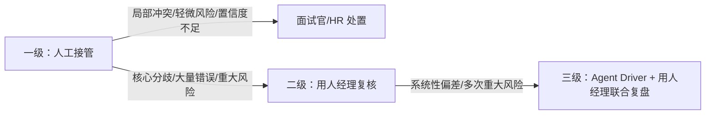

### 任务 2（续）：未来工作流与人机分工（20 分）
在 `03-human-agent-boundary.md` 中用表格说明：

| 环节 | Agent 可执行 | 人必须负责 | 升级条件 | 失败保护 |
|---|---|---|---|---|

要求至少覆盖：

- 敏感信息、偏见或歧视风险；
- 信息不足；
- 多个建议冲突；
- Agent 执行失败；
- 业务人员认为 Agent 判断错误。


---


## 一、文档定位

本文档承接 `01-diagnosis.md` 的诊断结论与 `02-future-workflow.md` 的流程设计，明确「面试证据与追问助手」全链路中 **Agent 与人（面试官/HR/用人经理/Agent Driver）的权责边界**。所有系统实现与操作规范均不得突破本文约束。

**通用准则**：
- AI 是证据整理工具，不是招聘决策者。
- 凡涉及录用/淘汰/定级/薪酬的决策，必须由人承担最终责任。
- Agent 所有分析结果必须绑定 `evidence_source` 原始溯源；无原始依据不得生成推断。
- 任何环节检测到敏感信息、偏见表达、提示词注入，Agent 仅标记风险，不得自主处置。

---

## 二、人机权责边界总表

| 环节 | Agent 可执行 | 人必须负责 | 升级条件 | 失败保护 |
|------|-------------|-----------|----------|----------|
| **1. 信号流入与敏感信息拦截** | ① 自动脱敏敏感字段（年龄、性别、婚育、籍贯等）；② 检测提示词注入、越权指令、偏见文本；③ 校验输入完整性（候选人 ID、岗位标准）；④ 对违规输入打上 `risk_flags` | ① 录入/上传结构化材料；② 初审明显违规输入；③ **判定风险材料是否继续流转**；④ 补充缺失材料 | 检测到敏感属性被用于评价依据；发现提示词注入或越权指令；输入材料严重缺失无法补录 | 自动阻断 Agent 运算；弹出标准化人工录入模板，流程降级为人工模式 |
| **2. 证据匹配与归类** | ① 将原始文本映射至 S1–S5 岗位标准；② 区分正向/反向证据、客观事实、候选人自述、合理推断；③ 标注每条证据的 `evidence_source` 原文片段 | ① **核验证据映射准确性**；② 手动调整证据归属维度；③ **区分有效证据与无效自述**；④ 判定证据权重 | 大量证据匹配偏差，人工大面积修正；Agent 将自述直接判定为客观事实；**业务人员认为 Agent 判断错误** | 关闭自动匹配，启用人工证据录入表格；支持版本回滚至 AI 初始输出 |
| **3. 多源冲突识别** | ① 对比多轮面试记录，客观标记观点矛盾点；② 陈列冲突双方原始依据；③ 检测主观偏见、违规筛选表述 | ① **判定冲突是否真实成立**；② 评估偏见/隐私风险标记是否有效；③ **决定冲突处置方式**；④ 协调面试官分歧 | **多维度建议冲突**无法依靠现有证据解决；人工不认同 Agent 的冲突/风险判定；核心能力维度证据矛盾 | 保留全部原始记录，冲突提交用人经理复核；安排追加面试，禁止 AI 自主调和 |
| **4. 缺口诊断与追问建议** | ① 识别各维度证据空白、未验证声明；② 区分事实缺口与推断缺口；③ 基于缺口生成行为面试题，标注考察目标与优先级 | ① **评估缺口是否需要补充面试**；② 筛选/修改/删除 AI 生成面试题；③ 结合面试节奏决定是否使用推荐问题 | **信息严重不足**（Low 置信度）；推荐问题脱离业务场景或存在引导性偏差；候选人回答与已有证据严重冲突 | Agent 仅陈列原始素材与缺口清单，不做推断；面试官使用内置标准题库；流程可搁置等待补充材料 |
| **5. 人工审核与确认** | ① 展示完整证据报告；② 保存 AI 原始输出版本；③ 记录人工确认操作日志 | ① **审阅完整证据全景报告**；② 微调内容后确认生效；③ **签署人工复核记录**；④ 最终录用/淘汰决策 | 人工确认后发现重大遗漏；**Agent 执行失败**或输出异常；人工质疑 Agent 分析结果 | 支持版本回滚至 AI 初始输出，重新复核；Agent 失效时完全切换人工模式，依据原始材料评审 |
| **6. 结果归档与经验沉淀** | ① 结构化组装候选人档案 JSON；② 多版本留存（原始材料、AI 初稿、人工修订版）；③ 统计偏差案例，输出规则偏差报告初稿 | ① **录入人工修改记录**；② 确认最终档案内容；③ 执行归档或终止；④ 审核规则调整方案 | 归档信息存在错误需修正；持续出现大批量 AI 识别偏差；多次出现同类重大风险 | 支持档案版本回溯，人工编辑重写；暂停规则自动统计，人工逐条整理案例库 |

---

## 三、Agent 绝对禁止清单（系统硬约束）

以下行为在系统层面强制阻断，触发即拦截：

| 序号 | 禁止行为 | 系统处置 |
|------|----------|----------|
| 1 | 输出录用、淘汰、能力评级、薪酬建议等任何决策结论 | 直接过滤决策关键词，强制 `human_decision_required: true` |
| 2 | 自主调和多面试官冲突、偏袒任意一方 | 仅允许客观陈列双方依据 |
| 3 | 将候选人自述直接判定为客观事实 | 必须标注为 `unverified_claims` |
| 4 | 依据敏感属性（年龄、性别、婚育、民族等）评价候选人 | 敏感字段脱敏，相关推理阻断 |
| 5 | 删除、篡改、隐匿原始面试记录 | 原始材料只读，Agent 仅生成衍生视图 |
| 6 | 绕过人工复核自动归档生效 | 归档前强制经过人工确认节点 |
| 7 | 自主修改 Prompt、匹配规则、风险正则 | 规则变更需 Agent Driver 提交 + 用人经理审批 |
| 8 | 诱导面试官关注受法律保护的敏感维度 | 生成面试题时二次校验敏感词 |

---

## 四、三级升级路径



**升级强制要求**：所有升级事件必须留存记录（候选人 ID、冲突内容、AI 输出原文、人工处置意见），存入候选人档案审计日志。

---

## 五、兜底原则

1. **凡是决策，必须是人；凡是分析，可以交给 Agent。**
2. 任何场景下，流程具备**脱离 Agent 独立运行**的完整人工备选方案。
3. 系统约束（硬拦截）+ 操作规范（人为管控）双重保障，防止单点失效。

---

## 六、模型执行失败保护策略

Agent 的核心分析能力依赖本地 LLM（Ollama + qwen:7b-q3_K_M）推理。在笔记本级硬件（8-16GB RAM）约束下，模型执行存在固有失败风险。本节定义 LLM 失败的全部已知场景及对应的系统保护机制。

### 6.1 模型执行失败的四种类型

## 6.1 模型执行失败的四种类型

| 失败类型 | 表现 | 触发条件 | 发生频率（当前实测） |
| ---- | ---- | ---- | ---- |
| A. 进程级崩溃（OOM） | Ollama 进程异常退出，退出码 -1 | num_ctx=4096 下 KV cache 超出可用 RAM | 低频（逐条运行 + 10s冷却基本可规避） |
| B. 空输出 | LLM 返回空字符串或仅含空白字符，JSON 解析报 `expected value at line 1 column 1` | Q3 量化模型稳定性偏弱；两类高发场景：遇到脱敏占位/干扰文本；连续批量推理内存堆积，引发持续性空输出（TC-002、TC-003故障场景） | 中频（5 条命中 3 条） |
| C. JSON 结构错误 | LLM 返回有效 JSON 但嵌套结构不合 Pydantic 校验（如 `evidence_by_criterion` 数组含非对象元素） | Q3 量化精度不足，复杂嵌套结构生成时注意力分散 | 中频（5 条中命中 3 条） |
| D. 语义偏差（静默失败） | JSON 结构正确但内容错误（证据串台、置信度误标、ID幻觉、模板占位残留） | 模型对约束规则的遵循度不足，量化精度导致指令遗漏 | 高频；后置规则仅能缓解，无法根除，必须依赖人工复核 |

### 6.2 五层纵深防护体系（当前已实现）

系统在 LLM 调用全链路上部署五层防护，确保任意一层失败均有兜底路径，不产生静默错误输出：

```
输入文本
   │
   ▼
[第1层] pre_filter（rules.py）            ← 规则引擎，不依赖 LLM
   │  敏感词脱敏 + 注入检测 + risk_flags 标记
   │  失败模式：无（纯 CPU 正则，确定性输出）
   │
   ▼
[第2层] _extract_json（main.py）          ← 语法级修复，不依赖 LLM
   │  非法转义清洗、null→[]、无引号键名加引号、截断补全
   │  失败模式：语法可修复 → 修正后 JSON；不可修复 → 原始字符串传递
   │
   ▼
[第3层] Pydantic model_validate_json      ← 结构强校验
   │  通过 → 进入第4层后置修复
   │  失败 → 触发 _build_fallback 兜底
   │
   ▼
[第4层] _post_process（main.py）           ← 规则级修复，不依赖 LLM
   │  candidate_id 强制覆盖、模板占位清除、null→[] 兜底
   │  修复 D 类语义偏差（实测效果：ID 修正 100%、占位清除 100%、null 兜底 100%）
   │
   ▼
[第5层] _build_fallback（main.py）         ← 终极兜底，不依赖 LLM
   │  输出标准化骨架：证据归入"异常兜底"维度 + risk_flags 载入全部错误详情
   │  人工可依据 risk_flags 中的错误描述快速定位问题
```

**关键设计原则**：第 1、2、4、5 层均为确定性规则引擎，不依赖 LLM，零 OOM 风险。第 3 层为唯一依赖 LLM 输出的环节，其失败由第 5 层完全兜底。

### 6.3 逐失败类型的保护映射

| 失败类型 | 触发层级 | 保护动作 | 输出形态 | 人工感知方式 |
|----------|----------|----------|----------|----------|
| A. OOM 崩溃 | Python 异常捕获（`except Exception`） | 直接进入第5层兜底，追加 `"LLM 服务调用失败，离线故障降级"` | fallback 骨架 | risk_flags 明确标注"离线故障" |
| B. 空输出 | 第3层 Pydantic 校验 → `JSONDecodeError` | 第2层修复无效 → 第3层失败 → 第5层兜底 | fallback 骨架 | risk_flags 含 `"Invalid JSON: expected value at line 1 column 1"` |
| C. 结构错误 | 第3层 Pydantic → `ValidationError` | 捕获所有 `e.errors()` 详情写入 risk_flags → 第5层兜底 | fallback 骨架 | risk_flags 含完整错误字段列表（如 `"字段 []: Input should be an object"`） |
| D. 语义偏差 | 第4层 `_post_process` | ID 覆盖 / 占位清除 / null 归零（规则级静默修复） | 修正后的正常输出 | 修复过程不产生日志（确定性规则，无需人工关注） |

### 6.4 LLM 连续失效的降级路径（待实现迭代方案）

当 LLM 持续出现 A/B/C 类失败时，系统应具备向规则引擎降级的能力。详见 `04-value-evaluation.md` 第十二章第 12.4 节「LLM 失效时的降级方案设计」。关键流程：

```
LLM 主路径（当前默认）
   │
   ├─ 正常运行 ──────────────────────────→ 输出 + 后置修复
   │
   └─ 连续 3 条 JSON 解析失败 ──────────→ 自动切换至降级模式
                                              │
                                    ┌─────────┘
                                    ▼
                           关键词+正则规则引擎（二级路径）
                              │  按段落拆分 → 关键词映射 S1-S5
                              │  正反证据：面试官评价极性匹配
                              │  自述类文本 → unverified_claims
                              │  evidence_source = 段落原文
                              │
                              ├─ 优势：零 OOM、确定性输出、可全量运行
                              └─ 局限：无法理解复杂语义、误匹配风险
                                    │
                              ┌─────┘
                              ▼
                           每 5 条后 LLM 健康检查（探测 1 条）
                              ├─ 连续 2 次通过 → 切回 LLM 主路径
                              └─ 仍失败 → 维持规则引擎模式
```

**重要约束**：规则引擎降级为短期过渡方案，不可替代 LLM 作为主推理单元。考题明确要求 LLM 作为核心分析引擎，规则引擎仅在 LLM 不可用时作为保底手段。

### 6.5 脱离 Agent 的纯人工备选流程

当 LLM 持续不可用且规则引擎降级亦无法满足质量要求时，业务团队可完全脱离 Agent 独立运行以下人工流程：

| 步骤 | 人工操作 | 输出物 | 预估耗时|
|------|----------|--------|----------|
| 1. 材料整理 | 面试官上传简历 + 面试记录原始文本 | 原始材料归档 | 5 min |
| 2. 证据标注 | HR 手动对照 S1-S5 标准，在原始文本中高亮证据片段 | 标注后的原始文本 | 15-20 min |
| 3. 冲突登记 | 面试官团队比对各自记录，手动登记观点分歧 | 冲突登记表 | 10 min |
| 4. 缺口列表 | 用人经理对照 S1-S5 逐维度勾选证据覆盖状态 | 证据缺口清单 | 5-10 min |
| 5. 追问设计 | 面试官基于缺口清单自行设计行为面试题 | 追问问题列表 | 10 min |
| 6. 风险自查 | HR 对照《Agent 绝对禁止清单》逐条自检评估记录 | 合规检查表 | 5 min |
| 7. 归档 | 人工组装标准化档案 JSON | 候选人档案 | 5 min |

**切换触发条件**：
- LLM 连续 5 条以上输出不可用（含兜底）
- 规则引擎降级模式下误匹配率超过 30%
- 业务团队明确要求暂停 AI 辅助

**恢复条件**：
- 硬件升级（RAM ≥ 32GB）或切换至更高精度模型（qwen:14b / 云端 API）
- 恢复前需通过离线评测（15 条标准用例全部通过核心指标）

---

## 七、与上下游文档关联

- 对照 `01-diagnosis.md`：通过清晰人机边界解决「评估标尺不一、主观偏差过大」痛点，从制度层面规避 AI 放大偏见风险。
- 对照 `02-future-workflow.md`：本文档「环节」列与工作流阶段一一对应；「升级条件」与「失败保护」列对齐 02 的 3.5 节异常处理 SOP。
- 支撑 `04-value-evaluation.md`：本文边界规则作为基线，用于评估「人工是否过度依赖 AI」「AI 是否越权」两类指标。


---
