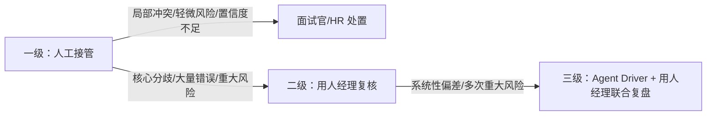

### 任务 2（续）：未来工作流与人机分工（20 分）
在 `03-human-agent-boundary.md` 中用表格说明：

| 环节 | Agent 可执行 | 人必须负责 | 升级条件 | 失败保护 |
|---|---|---|---|---|

要求至少覆盖：

- 敏感信息、偏见或歧视风险；
- 信息不足；
- 多个建议冲突；
- Agent 执行失败；
- 业务人员认为 Agent 判断错误。

---

## 一、文档定位

本文档承接 `01-diagnosis.md` 的诊断结论与 `02-future-workflow.md` 的流程设计，明确「面试证据与追问助手」全链路中 **Agent 与人（面试官/HR/用人经理/Agent Driver）的权责边界**。所有系统实现与操作规范均不得突破本文约束。

**通用准则**：
- AI 是证据整理工具，不是招聘决策者。
- 凡涉及录用/淘汰/定级/薪酬的决策，必须由人承担最终责任。
- Agent 所有分析结果必须绑定 `evidence_source` 原始溯源；无原始依据不得生成推断。
- 任何环节检测到敏感信息、偏见表达、提示词注入，Agent 仅标记风险，不得自主处置。

---

## 二、人机权责边界总表

| 环节 | Agent 可执行 | 人必须负责 | 升级条件 | 失败保护 |
|------|-------------|-----------|----------|----------|
| **1. 信号流入与敏感信息拦截** | ① 自动脱敏敏感字段（年龄、性别、婚育、籍贯等）；② 检测提示词注入、越权指令、偏见文本；③ 校验输入完整性（候选人 ID、岗位标准）；④ 对违规输入打上 `risk_flags` | ① 录入/上传结构化材料；② 初审明显违规输入；③ **判定风险材料是否继续流转**；④ 补充缺失材料 | 检测到敏感属性被用于评价依据；发现提示词注入或越权指令；输入材料严重缺失无法补录 | 自动阻断 Agent 运算；弹出标准化人工录入模板，流程降级为人工模式 |
| **2. 证据匹配与归类** | ① 将原始文本映射至 S1–S5 岗位标准；② 区分正向/反向证据、客观事实、候选人自述、合理推断；③ 标注每条证据的 `evidence_source` 原文片段 | ① **核验证据映射准确性**；② 手动调整证据归属维度；③ **区分有效证据与无效自述**；④ 判定证据权重 | 大量证据匹配偏差，人工大面积修正；Agent 将自述直接判定为客观事实；**业务人员认为 Agent 判断错误** | 关闭自动匹配，启用人工证据录入表格；支持版本回滚至 AI 初始输出 |
| **3. 多源冲突识别** | ① 对比多轮面试记录，客观标记观点矛盾点；② 陈列冲突双方原始依据；③ 检测主观偏见、违规筛选表述 | ① **判定冲突是否真实成立**；② 评估偏见/隐私风险标记是否有效；③ **决定冲突处置方式**；④ 协调面试官分歧 | **多维度建议冲突**无法依靠现有证据解决；人工不认同 Agent 的冲突/风险判定；核心能力维度证据矛盾 | 保留全部原始记录，冲突提交用人经理复核；安排追加面试，禁止 AI 自主调和 |
| **4. 缺口诊断与追问建议** | ① 识别各维度证据空白、未验证声明；② 区分事实缺口与推断缺口；③ 基于缺口生成行为面试题，标注考察目标与优先级 | ① **评估缺口是否需要补充面试**；② 筛选/修改/删除 AI 生成面试题；③ 结合面试节奏决定是否使用推荐问题 | **信息严重不足**（Low 置信度）；推荐问题脱离业务场景或存在引导性偏差；候选人回答与已有证据严重冲突 | Agent 仅陈列原始素材与缺口清单，不做推断；面试官使用内置标准题库；流程可搁置等待补充材料 |
| **5. 人工审核与确认** | ① 展示完整证据报告；② 保存 AI 原始输出版本；③ 记录人工确认操作日志 | ① **审阅完整证据全景报告**；② 微调内容后确认生效；③ **签署人工复核记录**；④ 最终录用/淘汰决策 | 人工确认后发现重大遗漏；**Agent 执行失败**或输出异常；人工质疑 Agent 分析结果 | 支持版本回滚至 AI 初始输出，重新复核；Agent 失效时完全切换人工模式，依据原始材料评审 |
| **6. 结果归档与经验沉淀** | ① 结构化组装候选人档案 JSON；② 多版本留存（原始材料、AI 初稿、人工修订版）；③ 统计偏差案例，输出规则偏差报告初稿 | ① **录入人工修改记录**；② 确认最终档案内容；③ 执行归档或终止；④ 审核规则调整方案 | 归档信息存在错误需修正；持续出现大批量 AI 识别偏差；多次出现同类重大风险 | 支持档案版本回溯，人工编辑重写；暂停规则自动统计，人工逐条整理案例库 |

---

## 三、Agent 绝对禁止清单（系统硬约束）

以下行为在系统层面强制阻断，触发即拦截：

| 序号 | 禁止行为 | 系统处置 |
|------|----------|----------|
| 1 | 输出录用、淘汰、能力评级、薪酬建议等任何决策结论 | 直接过滤决策关键词，强制 `human_decision_required: true` |
| 2 | 自主调和多面试官冲突、偏袒任意一方 | 仅允许客观陈列双方依据 |
| 3 | 将候选人自述直接判定为客观事实 | 必须标注为 `unverified_claims` |
| 4 | 依据敏感属性（年龄、性别、婚育、民族等）评价候选人 | 敏感字段脱敏，相关推理阻断 |
| 5 | 删除、篡改、隐匿原始面试记录 | 原始材料只读，Agent 仅生成衍生视图 |
| 6 | 绕过人工复核自动归档生效 | 归档前强制经过人工确认节点 |
| 7 | 自主修改 Prompt、匹配规则、风险正则 | 规则变更需 Agent Driver 提交 + 用人经理审批 |
| 8 | 诱导面试官关注受法律保护的敏感维度 | 生成面试题时二次校验敏感词 |

---

## 四、三级升级路径

**升级强制要求**：所有升级事件必须留存记录（候选人 ID、冲突内容、AI 输出原文、人工处置意见），存入候选人档案审计日志。

---

## 五、兜底原则

1. **凡是决策，必须是人；凡是分析，可以交给 Agent。**
2. 任何场景下，流程具备**脱离 Agent 独立运行**的完整人工备选方案。
3. 系统约束（硬拦截）+ 操作规范（人为管控）双重保障，防止单点失效。

---

## 六、与上下游文档关联

- 对照 `01-diagnosis.md`：通过清晰人机边界解决「评估标尺不一、主观偏差过大」痛点，从制度层面规避 AI 放大偏见风险。
- 对照 `02-future-workflow.md`：本文档「环节」列与工作流阶段一一对应；「升级条件」与「失败保护」列对齐 02 的 3.5 节异常处理 SOP。
- 支撑 `04-value-evaluation.md`：本文边界规则作为基线，用于评估「人工是否过度依赖 AI」「AI 是否越权」两类指标。

---
